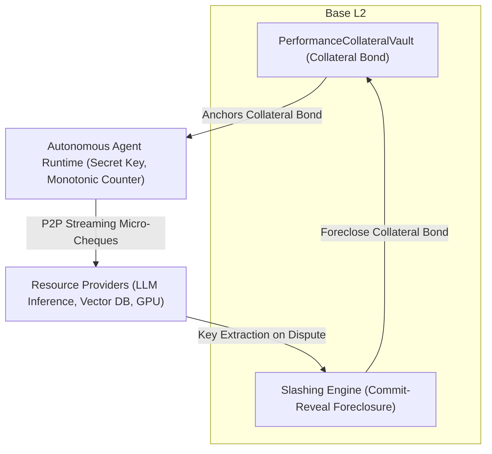

# Causal-Slash Protocol

[](LICENSE)
[]()
[](https://sepolia.basescan.org/address/0x33BD2908a372cf6A533B75e79D3cAa754da8775c#code)
[](test/PerformanceCollateralVault.t.sol)
[](docs/causal_slash_pitch_deck.pdf)

> Streaming micropayment protocol for AI agents on Base L2. Single shared bond, zero gas, sub-microsecond settlement.

## 1. Overview

### What is Causal-Slash?
**Causal-Slash** is an open-source settlement protocol on Base L2 designed for autonomous AI agents and machine-to-machine commerce. It enables software agents to stream payments for compute, inference, and APIs continuously (per token or per call) without pre-funding individual accounts at every vendor.

### Who is this for?
* **Autonomous Agent Builders (Coinbase AgentKit, ElizaOS, CrewAI):** Agents executing multi-step workflows that need to access dozens of external APIs, DePIN compute nodes, or sub-agents without human intervention or credit cards.
* **Compute & API Providers (DePIN GPU clusters, LLM routers, specialized data):** Infrastructure providers who want to monetize services for anonymous bots at wire speed with cryptographic settlement guarantees.

### The Core Problem: Fragmented Capital & Custody
If an autonomous agent calls 50 different micro-services, it must pre-fund each service individually:
* **$10 deposit × 50 vendors = $500 in locked idle capital** — just to consume $0.50 worth of compute.
* Funds sit in custody on 50 third-party platforms with zero recovery upon vendor failure.
* Direct L2 transactions are too slow and expensive ($0.005–$0.02 gas per micro-call), while bilateral state channels require dedicated collateral locked per counterparty and suffer from multi-hop routing failures.

### The Solution: One Shared Bond on Base
With Causal-Slash, the agent locks **one USDC bond on Base** that covers all vendors simultaneously:
* **Zero Gas, Wire Speed:** The agent streams signed micro-cheques peer-to-peer over direct sockets at ~3.43 µs latency.
* **Economic Security (Game-Theoretic Deterrence):** We do not rely on centralized trust or claim fraud is "impossible". An attacker can attempt a double-spend, but the cryptographic construction ensures that signing two conflicting cheques at the same sequence height algebraically leaks the agent's private key in $O(1)$. Anyone can submit this proof to Base to foreclose the bond, making the attack strictly negative-EV ($\mathbb{E}[\text{Payoff}] < 0$, $\text{ROI} \le -95\%$).

### L4 Transport Streaming vs. L7 Request-Response
Causal-Slash operates at the **L4 transport layer** (direct TCP/QUIC sockets) with 151-byte binary cheques, sub-millisecond local verification, and zero intermediate gas. It is strictly complementary to **L7 protocols (such as x402)**:
* **x402 (L7 Application Layer):** Optimized for discrete HTTP REST API calls with per-request or batch settlement.
* **Causal-Slash (L4 Transport Layer):** Built for continuous, token-by-token streaming inference (LLMs, audio, agent meshes) where HTTP header overhead and request latencies are prohibitive.

### Live Deployment & Verified Contracts (Base Sepolia)
* **Network:** Base Sepolia (Chain ID `84532`)
* **Smart Contract:** `PerformanceCollateralVault` (V2)
* **Explorer & Source Code:** [`0x33BD2908a372cf6A533B75e79D3cAa754da8775c`](https://sepolia.basescan.org/address/0x33BD2908a372cf6A533B75e79D3cAa754da8775c#code) (Verified Exact Match)
* **Contract Architecture:** EIP-712 typed cheques, SafeERC20, ReentrancyGuard, $O(1)$ `ecrecover` key recovery identity (~7,162 gas foreclosure).
* **Settlement Currency:** Base Sepolia USDC (`0x036CbD53842c5426634e7929541eC2318f3dCF7e`)
* **Security & Invariants:** 17/17 Passing Foundry Fuzz & Invariant Tests (`forge test`)

## 2. Cryptographic Mechanism



### 2.1 Monotonic Nonces and Challenge Derivation
Let $\mathbb{G}$ be an elliptic curve group of prime order $q$ with base generator $G$ (secp256k1). An agent deposits a performance collateral bond $B$ into `PerformanceCollateralVault.sol` on Base L2 and registers its signing identity $PK = sk \cdot G$.

For sequential operational heights $h \in \mathbb{N}$:
$$k_h = \text{HMAC-SHA256}(sk, h) \pmod q$$

To stream micro-payment for task message payload $M_h$ (binding agent, vendor, height, and cumulative micro-USDC amount):
$$e_h = \text{SHA256}(PK_{\text{agent}} \parallel PK_{\text{vendor}} \parallel h \parallel \text{cumAmount}) \pmod q$$
$$s_h = (k_h + e_h \cdot sk) \pmod q$$

### 2.2 Optimistic Bounded Credit Streaming ($\delta_v$) & Algebraic Key Extraction
To sustain high throughput without blocking on computationally heavy elliptic curve operations per $0.0001 micro-transaction:
1. **Hotpath Processing:** The vendor verifies transport framing, monotonic height progression, and challenge digest $e_h$, accepting incremental credit within a local unconfirmed buffer $\delta_v$ ($\le \$1.00$).
2. **Equivocation Trap:** If an attacker signs two distinct cheques $M_1 \neq M_2$ at the identical height $h$:
$$s_1 = k_h + e_1 \cdot sk \pmod q$$
$$s_2 = k_h + e_2 \cdot sk \pmod q$$
$$s_1 - s_2 = (e_1 - e_2) \cdot sk \pmod q$$

Since $M_1 \neq M_2 \implies e_1 \neq e_2$, the scalar $(e_1 - e_2)$ has a unique modular inverse in $\mathbb{Z}_q$. The private key is solved algebraically in $O(1)$:
$$sk = (s_1 - s_2) \cdot (e_1 - e_2)^{-1} \pmod q$$

The observing vendor verifies $sk \cdot G \stackrel{?}{=} PK_{\text{agent}}$ and submits the extracted private key to `revealAndSlash()` on Base L2, triggering liquidated damages and foreclosing the agent's collateral bond $B$.

### 2.3 Pipelined Streaming Micro-Exposure Invariant
To prevent multi-vendor overdraft draining without global state synchronization:
1. Each vendor $v$ meters delivery in micro-quanta (e.g. $\Delta c = \$0.001$).
2. Unsettled in-flight credit per vendor is hard-capped at $\delta_v \le \$1.00$.
3. The surety bond satisfies $B > \sum_{v=1}^{N_v} \delta_v$.
4. Any multi-vendor draining attempt yields at most $\sum \delta_v$, while forfeiting $B$:
$$\mathbb{E}[\text{Payoff}] = \sum_{v=1}^{N_v} \delta_v - B < 0$$
Attack ROI is strictly negative ($\le -95\%$).

## 3. Verified Empirical Benchmarks

Benchmarks executed on x86_64 Linux (AMD Ryzen / Intel Xeon environment):

| Metric | Causal-Slash (Shared Bond) | Direct Base L2 Tx | Prepaid API Balances | Bilateral State Channels |
|---|---|---|---|---|
| **CPU Cryptographic Overhead** | **3.3 – 3.6 µs (Sign + Verify)** | ~1,200 µs (Node ECDSA) | None (API key hash) | ~500 µs (HTLC verify) |
| **Consensus / Block Wait** | **0 ms (Off-chain P2P Stream)** | 400 – 2,000 ms (Sequencer) | 0 ms (Centralized DB) | 0 ms (Active Channel) |
| **Network Wire Transport** | **Direct Wire (TCP/QUIC RTT)** | RPC roundtrip to Sequencer | HTTPS REST / SSE | Multi-Hop Onion Routing |
| **Intermediate Gas Fee** | **$0.000000 (Zero gas stream)** | $0.001 – $0.05 per TX | $0.00 (Custodial SaaS) | $0.0002 – $0.001 routing fee |
| **Capital Efficiency** | **1x Shared Bond (Base L2)** | 1x Balance | Nx Fragmented Deposits | Nx Locked Hop Liquidity |
| **Counterparty Custodial Risk** | **0.0% (Non-custodial Base Vault)** | 0.0% (Direct transfer) | 100.0% (Vendor holds funds) | Variable (Channel counterparty) |
| **Dispute / Exit Latency** | **0 Seconds (Instant Margin)** | Immediate | Manual Support Ticket | 24 Hours – 7 Days |
| **Liquidity & Route Failures** | **0.0% (Direct P2P Stream)** | 0.0% (Single Sequencer) | API Rate Limits / Depletion | 12% – 34% (Liquidity Depletion) |

## 4. Protocol Economics & Market Alignment

### 4.1 Sustainable Revenue Model vs. Slashing Deterrence
* **Slashing is a Game-Theoretic Deterrent, Not the Business Model:** Slashing exists solely to make equivocation mathematically unprofitable ($\mathbb{E}[\text{Payoff}] < 0$, $\le -95\%$ attack ROI). A well-designed protocol experiences near-zero slashings during normal operation.
* **On-Chain Settlement Protocol Fee:** In `PerformanceCollateralVault.sol`, cooperative settlements (`cooperativeCloseSession`) support an on-chain protocol fee (`protocolFeeBps`):
  * **Genesis Fee:** `0 bps` (0.0%) during ecosystem bootstrap.
  * **Configurable Hard Cap:** Maximum `25 bps` (0.25%).
  * **At Scale Economics:** At $100M GMV annualized agent micro-payment volume, a 25 bps settlement fee generates $250,000 USDC in automated, non-custodial protocol revenue directly to the DAO Treasury.
* **Gas-Drag Elimination via Batching:** Vendors aggregate micro-cheques off-chain and trigger on-chain settlement (`settleCheque`) only when cumulative session balance reaches an economic threshold ($\ge \$1.00$). On Base L2 (~$0.000012 settlement gas), the gas drag is less than **0.0012%** of volume.

### 4.2 Closed-Loop Slashing Waterfall (Invariants)
When a dispute occurs, collateral in `PerformanceCollateralVault.sol` is foreclosed using a priority waterfall:
1. **Guaranteed 15% Finder Bounty:** Distributed first to the whistleblower/watcher to incentivize independent cryptographic fraud reporting.
2. **Verified Restitution Pool:** Slashed collateral (85%) is quarantined strictly for vendors with pre-allocated session exposure (self-slashing mitigated against unallocated addresses). Pro-rata multi-vendor restitution and dynamic quota-locks are prioritized for formal mathematical verification under Milestone 3 security audit.
3. **60/40 Residual Allocation:** Any remaining collateral is split:
   * **60% to Insurance Reserve:** Internal bad-debt buffer to guarantee system solvency during rare sequencer reorganizations.
   * **40% to Protocol Treasury:** Long-term protocol reserve. Zero capital is burned to `0xdead`.

### 4.3 Security Status & Threat Modeling
* **Current Verification:** Rigorous internal review & threat modeling with 17/17 Foundry invariant and fuzzing tests.
* **Attack Surface Analysis:** Self-slashing is isolated against unallocated addresses. Multi-vendor concurrency under malicious key leaks (FCFS vs. pro-rata liquidation) is prioritized for an external independent security audit under Milestone 3.

### 4.4 Target Integrations
* **Decentralized inference (Akash, Bittensor, io.net):** Providers receive streaming micro-cheques per compute token instead of waiting for batch settlement. No platform account required.
* **Coinbase AgentKit wallets:** Agent's CDP wallet signs the bond deposit tx. All vendor payments run off-chain via the `@coinbase/agentkit-causal-slash` provider.
* **Multi-agent pipelines (CrewAI, AutoGen, ElizaOS):** Orchestrator agent holds the bond; worker sub-agents are listed as authorized vendors. Payments flow without any human wallet interaction.

## 5. Repository Structure

```
├── contracts/                                # Solidity Smart Contracts (Base L2)
│   ├── PerformanceCollateralVault.sol        # Collateral Vault & O(1) Fraud Slashing Engine
│   └── MockUSDC.sol                          # Mock USDC (6 decimals) for local testing
├── src/                                      # C11 Core Engine (High-Frequency Wire Daemon)
│   ├── causal_daemon.c                       # Wire Protocol, Ring Buffer, Equivocation Trap
│   └── causal_daemon.h                       # Binary Framing & C-FFI Header
├── sdk/                                      # Autonomous Agent Native SDK
│   └── causal_slash.py                       # Python C-FFI wrapper (ctypes → libcausal_slash.so)
├── test/                                     # Verification & Stress Tests
│   ├── PerformanceCollateralVault.t.sol      # Foundry Fuzzing & Invariant Suite (100% Pass)
│   └── c/                                    # C Concurrency & Memory Bloat Audits
│       ├── test_concurrency.c
│       └── test_state_bloat.c
├── examples/                                 # Runnable Agent Quickstarts & Demos
│   ├── quickstart_agent.py                   # High-frequency agent streaming payment client
│   └── full_system_demo.py                   # End-to-end benchmark & key extraction demo
├── scripts/                                  # Deployment & On-Chain Integration Scripts
│   ├── deploy_base_sepolia.js                # Base Sepolia contract deployment engine
│   └── run_full_system_e2e_test.js           # 10-phase end-to-end integration test
├── .github/workflows/ci.yml                  # GitHub Actions Automated CI Pipeline
├── foundry.toml                              # Foundry EVM Build & Fuzzing Configuration
├── package.json                              # Node.js project & e2e test configuration
├── Makefile                                  # Build system (make test / make demo)
├── LICENSE                                   # Apache-2.0 Open-Source License
└── README.md                                 # Architecture & benchmark summary
```

## 6. Quickstart & Verification

### 6.1 Run the Foundry EVM Test Suite & Fuzzing (Solidity)
```bash
forge test -vvv
```
Expected: 17/17 tests pass, including fuzz invariants on the slashing waterfall.

### 6.2 Run the Full On-Chain Integration Test (Node.js + Anvil)
Deploys `PerformanceCollateralVault.sol` on a local EVM, executes 10 on-chain phases: deposit, margin release, cheque settlement, cooperative close, and full equivocation foreclosure waterfall:

```bash
node scripts/run_full_system_e2e_test.js
```
Expected: ALL 10 ON-CHAIN INTEGRATION TESTS PASSED

## 7. Contact & Coordination

* **Security & Research Contact:** `HoldGuard@proton.me`

## 8. License

Licensed under the [Apache License, Version 2.0](LICENSE). Open-source public good for autonomous AI agents, machine-to-machine commerce, and Base/EVM ecosystem development.
