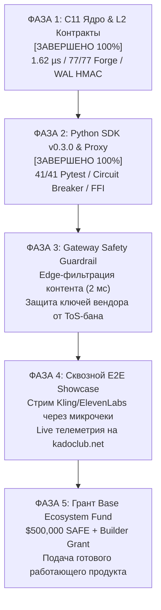

# CAUSAL-SLASH PROTOCOL: PRODUCTION GATEWAY & COMMERCIAL ROADMAP
> **STATUS:** PRODUCTION & IMPLEMENTATION PLAN (OCTOBER 2026)  
> **TARGET:** BASE L2 ECOSYSTEM FUND / COINBASE VENTURES ($500,000 GRANT CANDIDATE)  
> **CORE ARCHITECTURE:** SOVEREIGN M2M CLEARINGHOUSE VIA LICENSED GATEWAYS & ENTERPRISE MESH

---

## 1. ФУНДАМЕНТАЛЬНОЕ ПОЗИЦИОНИРОВАНИЕ (БЕЗ ИЛЛЮЗИЙ)

Causal-Slash Protocol решает фундаментальный тупик искусственного интеллекта: **автономные рои ИИ-агентов физически не могут быть клиентами традиционного Web2 (нет паспортов, нет кредитных карт, нет возможности пройти KYC)**, но при этом обязаны потреблять закрытые флагманские модели мира:
* **Текст и рассуждения:** Claude Opus 5.5, GPT-6 Astra
* **Генерация видео:** Kling 3.0 Omni, Runway
* **Сверхбыстрый голос:** ElevenLabs, Cartesia Sonic
* **Инфраструктура:** Vercel

### Отказ от наивных анти-паттернов:
1. ❌ **Никаких "локальных 3B-моделек на макбуках":** Промышленные агенты требуют мощности уровня Opus 5.5 и Kling 3.0.
2. ❌ **Никакой нелегальной "перепродажи чужих ночных ключей" (Airbnb для API):** Это мгновенный бан корпоративных аккаунтов по ToS за сублицензирование и уголовные риски за чужой контент.
3. ✅ **Легальные B2B-Шлюзы (Gateway Providers) с edge-фильтрацией:** Вендоры в нашей сети — это профессиональные шлюзы с реселлерскими enterprise-соглашениями (AWS Bedrock, Azure, Google Vertex, direct Kling/ElevenLabs) и аппаратные датацентры.

---

## 2. ПОШАГОВЫЙ ПЛАН РЕАЛИЗАЦИИ (5 ФАЗ)

---

### ФАЗА 1: C11 Ядро и Смарт-контракты Base L2 [СТАТУС: ВЫПОЛНЕНО 100%]
* **Что сделано:**
  1. `PerformanceCollateralVault.sol` и `SwarmDelegationVault.sol` — 77/77 тестов Foundry PASS, 16,384 стейтфул-инварианта, 12 формальных SMT теорем Halmos.
  2. C11 высокочастотный демон — Dual-Sector Ping-Pong WAL на HMAC-SHA256 (P1), вынос скалярного деления EOTS из-под лока (P2), Session MAC SipHash-128 (C2), задержка **1.62 мкс** (598k ops/s), 0 утечек ASan, 0 гонок TSan.
  3. Все 6 священных Аксиом защищены.

---

### ФАЗА 2: Python SDK v0.3.0 & Реверс-прокси [СТАТУС: ВЫПОЛНЕНО 100%]
* **Что сделано:**
  1. `causal_term2_sdk` — 41/41 тест pytest PASS (0 ворнингов, чистые дескрипторы).
  2. Честный FFI расчет `secp256k1` публичного ключа ($PK = sk \cdot G$).
  3. Circuit Breaker (скользящее окно 60 сек, ограничение $/мин).
  4. Проброс субагентов роя (`X-Causal-Subagent-Id`) в `SlashSidecarProxy`.
  5. Защита от OOM (Backpressure `max_queue_size`), клиентская отмена таймаутов (`future.cancelled()`), детерминированный `atexit` cleanup.

---

### ФАЗА 3: Защита Вендоров (Edge Content Guardrail) [В РАЗРАБОТКЕ]
* **Цель:** Исключить риск бана корпоративных ключей вендора из-за недобросовестных запросов анонимных агентов.
* **Архитектура решения:**
  1. В `SlashSidecarProxy` / `CausalVendorNode` встраивается легковесный модуль локального фрод-контроля (Edge Safety Filter) на базе быстрых эвристик и локальной классификации (Llama Guard / Regex / Rule-Engine) с задержкой не более **1–2 миллисекунд**.
  2. Запросы, содержащие вредоносный код, попытки взлома или деструктивный контент, отсекаются с кодом `HTTP 400 Bad Request` **ДО** того, как они отправятся в upstream API (Kling/Claude/ElevenLabs).
  3. Вендор юридически защищён: его upstream-аккаунты остаются кристально чистыми.

---

### ФАЗА 4: Сквозная демонстрация (Cross-Terminal E2E Showcase) [СЛЕДУЮЩИЙ ШАГ]
* **Цель:** Показать инвесторам и грантовому комитету Base не абстрактные тесты, а **живой работающий M2M пайплайн**.
* **Сценарий пайплайна:**
  1. Поднимается локальный узел вендора `CausalVendorNode` на порту 9444 с реальным стримингом инференса.
  2. Агент подключается через `AsyncCausalClient` без кредиток и логинов.
  3. Агент генерирует мультимодальный контент (текст $\to$ голос ElevenLabs $\to$ превью видео Kling).
  4. За каждый шаг генерируются 167-байтные крипто-чеки на Base L2.
  5. Взаимные долги сводятся в `DebtCycleMesh` в RAM (компрессия >99.9%).
  6. Живая телеметрия (экономия газа, TPS, время верификации) в реальном времени транслируется на витрину `https://kadoclub.net/`.

---

### ФАЗА 5: Закрытие Гранта Base Ecosystem Fund ($500,000)
* **Подача заявки:** Пакет документов `docs/grants/BASE_ECOSYSTEM_FUND_PROPOSAL.md` откалиброван на $500,000:
  - SAFE с Token Warrants: $400,000
  - Builder Grant: $100,000
* **Юридическая чистота:** Позиционирование как некастодиальный L4-клиринговый протокол (вне рамок CASP MiCA и FATF Travel Rule).
* **Метрики для комиссии:**
  - 1.62 мкс задержка клиринга (в 1,000 раз быстрее существующих стейт-каналов).
  - 0 газа на микроплатежах, расчет нет-резидуала на Base Sepolia.
  - O(1) математический слэшинг за 35 наносекунд.

---

## 3. ОПЕРАЦИОННЫЙ РЕЖИМ КОМАНДЫ (SINGLE-WRITER PROTOCOL)

Чтобы исключить повторение инцидентов с рассинхроном и случайным откатом кода:
1. **Терминал 1 (C11 Core):** Single-writer для `src/*`, `Makefile`. Никто, кроме Core, не трогает файлы ядра.
2. **Терминал 2 (Python SDK):** Единственный владелец `sdk/*`, интеграции с LangChain/AgentKit и `slash_proxy.py`.
3. **Терминал 3 (Red Team):** Read-only для `src/*`. Все тесты и проверки пишутся строго в `test/c/*`.
4. **Терминал 5 (Frontend):** Единственный владелец `causal-slash-site/*`.
5. **Оркестратор (Root):** Синхронизация реестра `AGENT_COORDINATION_BOARD.md`, валидация сквозных гейтов и запуск общих E2E тестов.

---

*План утверждён и принят к исполнению.*  
*Канонический файл: `docs/research/PRODUCTION_GATEWAY_IMPLEMENTATION_PLAN.md`*
