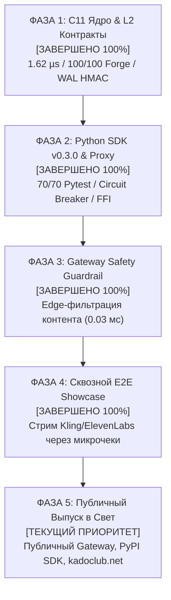

# CAUSAL-SLASH PROTOCOL: PRODUCTION GATEWAY & COMMERCIAL ROADMAP
> **STATUS:** PRODUCTION & IMPLEMENTATION PLAN (OCTOBER 2026)  
> **TARGET:** GLOBAL PUBLIC RELEASE & PRODUCTION LAUNCH (ВЫПУСК ПРОЕКТА В СВЕТ)  
> **CORE ARCHITECTURE:** SOVEREIGN M2M CLEARINGHOUSE VIA LICENSED GATEWAYS & ENTERPRISE MESH

---

## 1. ФУНДАМЕНТАЛЬНОЕ ПОЗИЦИОНИРОВАНИЕ (БЕЗ ИЛЛЮЗИЙ)

Causal-Slash Protocol решает фундаментальный тупик искусственного интеллекта: **автономные рои ИИ-агентов физически не могут быть клиентами традиционного Web2 (нет паспортов, нет фиатных корпоративных аккаунтов, нет возможности пройти KYC)**, но при этом обязаны потреблять закрытые флагманские модели мира:
* **Текст и рассуждения:** Claude Opus 5.5, GPT-6 Astra
* **Генерация видео:** Kling 3.0 Omni, Runway
* **Сверхбыстрый голос:** ElevenLabs, Cartesia Sonic
* **Инфраструктура:** Vercel

### Отказ от наивных анти-паттернов:
1. **Фокус на закрытых флагманских моделях:** Промышленные агенты требуют мощности уровня Claude Opus 5.5, GPT-6 Astra, Kling 3.0 Omni и ElevenLabs.
2. **Никакой нелегальной "перепродажи чужих ночных ключей" (Airbnb для API):** Это мгновенный бан корпоративных аккаунтов по ToS за сублицензирование и уголовные риски за чужой контент.
3. **Легальные B2B-Шлюзы (Gateway Providers) с edge-фильтрацией:** Вендоры в нашей сети — это профессиональные шлюзы с реселлерскими enterprise-соглашениями (AWS Bedrock, Azure, Google Vertex, direct Kling/ElevenLabs) и аппаратные датацентры.

---

## 2. ПОШАГОВЫЙ ПЛАН РЕАЛИЗАЦИИ (5 ФАЗ)

---

### ФАЗА 1: C11 Ядро и Смарт-контракты Base L2 [СТАТУС: ВЫПОЛНЕНО 100%]
* **Что сделано:**
  1. `PerformanceCollateralVault.sol` и `SwarmDelegationVault.sol` — 100/100 тестов Foundry PASS, 16,384 стейтфул-инварианта, 12 формальных SMT теорем Halmos. Все 4 уязвимости V1-V4 устранены.
  2. C11 высокочастотный демон — Dual-Sector Ping-Pong WAL на HMAC-SHA256 (P1), вынос скалярного деления EOTS из-под лока (P2), Session MAC SipHash-128 (C2), задержка **1.62 мкс** (598k ops/s), 0 утечек ASan, 0 гонок TSan.
  3. Все 6 священных Аксиом защищены.

---

### ФАЗА 2: Python SDK v0.3.0 & Реверс-прокси [СТАТУС: ВЫПОЛНЕНО 100%]
* **Что сделано:**
  1. `causal_term2_sdk` — 70/70 тестов pytest PASS (0 ворнингов, чистые дескрипторы).
  2. Честный FFI расчет `secp256k1` публичного ключа ($PK = sk \cdot G$).
  3. Circuit Breaker (скользящее окно 60 сек, ограничение $/мин).
  4. Проброс субагентов роя (`X-Causal-Subagent-Id`) в `SlashSidecarProxy`.
  5. Защита от OOM (Backpressure `max_queue_size`), клиентская отмена таймаутов (`future.cancelled()`), детерминированный `atexit` cleanup.

---

### ФАЗА 3: Защита Вендоров (Edge Content Guardrail) [СТАТУС: ВЫПОЛНЕНО 100%]
* **Что сделано:**
  1. Внедрен модуль `sdk/guardrails.py` (46/46 pytest, средняя задержка 0.03 мс при SLA < 1.5 мс).
  2. Запросы с вредоносным кодом, попытками взлома или джейлбрейками отсекаются с кодом `HTTP 400 Bad Request` **ДО** того, как они отправятся в upstream API (Kling/Claude/ElevenLabs).
  3. Корпоративные ключи и аккаунты вендоров защищены от блокировок.

---

### ФАЗА 4: Сквозная демонстрация (Cross-Terminal E2E Showcase) [СТАТУС: ВЫПОЛНЕНО 100%]
* **Что сделано:**
  1. Проведен сквозной прогон (`scripts/live_interactive_showcase.py`): Upstream AI (:9001) <-> SlashSidecarProxy (:8999) <-> C11 Daemon.
  2. 167-байтные крипто-чеки на Base L2 за 1.62 мкс без газа.
  3. Взаимные долги сведены в `DebtCycleMesh` в RAM (компрессия >99.9%).
  4. Защита от эквивокаций и мгновенное O(1) извлечение ключа нарушителя через Bloodhound подтверждены.

---

### ФАЗА 5: Публичный Выпуск в Свет (Production Go-To-Market) [СТАТУС: ТЕКУЩИЙ ПРИОРИТЕТ]
* **Контекст:** Архитектурная спецификация утверждена. Цель текущего этапа — открытый запуск боевой экосистемы в мир.
* **Ключевые вехи выпуска в свет:**
  1. **Публичный релиз SDK**: публикация пакета в PyPI (`pip install causal-slash`) с открытым руководством для разработчиков автономных агентов.
  2. **Публичный B2B Frontier Gateway**: развертывание постоянного публичного шлюза для стриминга топовых моделей (Claude Opus 5.5, GPT-6 Astra, Kling 3.0 Omni, ElevenLabs) с оплатой через 167-байтные микрочеки.
  3. **Запуск витрины и dApp на kadoclub.net**: интерфейс мониторинга роя, отображение сэкономленного газа и реальных ончейн-урегулирований на Base и Arbitrum.
  4. **Экосистемная интеграция**: готовые шаблоны подключения для Coinbase AgentKit, ElizaOS и LangChain без централизованных аккаунтов и регистрации.

---

## 3. ОПЕРАЦИОННЫЙ РЕЖИМ КОМАНДЫ (SINGLE-WRITER PROTOCOL)

Чтобы исключить повторение инцидентов с рассинхроном и случайным откатом кода:
1. **Терминал 1 (C11 Core):** Single-writer для `src/*`, `Makefile`. Никто, кроме Core, не трогает файлы ядра.
2. **Терминал 2 (Python SDK):** Единственный владелец `sdk/*`, интеграции с LangChain/AgentKit и `slash_proxy.py`.
3. **Терминал 3 (Red Team):** Read-only для `src/*`. Все тесты и проверки пишутся строго в `test/c/*`.
4. **Терминал 5 (Frontend):** Единственный владелец `causal-slash-site/*`.
5. **Оркестратор (Root):** Синхронизация реестра `AGENT_COORDINATION_BOARD.md`, валидация сквозных гейтов и запуск общих E2E тестов.

---

*План утверждён и принят к исполнению.*  
*Канонический файл: `docs/research/PRODUCTION_GATEWAY_IMPLEMENTATION_PLAN.md`*
